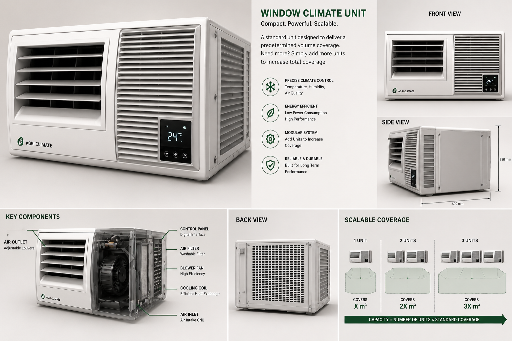

# Heat-Pump Powered Modular Dehydrator


An R&D project on a compact, modular heat-pump-powered dehydrator designed for off-grid agricultural drying of spices, fruits, fish, and grains. Combines first-principles psychrometric sizing with SolidWorks CAD and economic payback modelling to deliver a window-unit form factor system with linear capacity scaling through modular parallel-unit architecture.

---

## Concept Render



*Compact. Powerful. Scalable. — Window-unit form factor with adjustable air outlet louvers, integrated digital control panel, blower fan, and finned cooling coil. Modular parallel-unit architecture allows linear capacity scaling (2× units → 2× throughput).*

---

## Overview

The project addresses post-harvest crop loss for smallholder farmers in tropical regions, where all existing drying options carry serious limitations:

| Method | Limitation |
|---|---|
| Sun drying | Weather-dependent, slow, contamination exposure |
| Resistive electric dryers | 2–3 kWh per kg moisture removed — high operating cost |
| LPG / biomass dryers | Fuel price volatility, direct combustion emissions |
| All of the above | No linear scaling — more capacity means a whole new system |

The heat pump dehydrator targets three properties simultaneously: **energy-efficient** (moves heat instead of generating it), **standalone** (window-unit form factor, no specialist installation), and **modular** (parallel units for linear capacity scaling).

---

## Highlights

- Compact window-unit form factor — 600 × 350 mm cross-section (from concept render)
- **~73% energy reduction** vs equivalent resistive heating (validated by thermal model)
- Dual function: heating + dehumidification from a single 1.5 kW refrigeration cycle
- Drying air delivered at **55 °C, ~25% RH** — ideal conditions for spice, fruit, fish
- Moisture removal rate: **~3.7 kg/hr** at design operating point
- Modular parallel-unit architecture for linear capacity scaling
- SolidWorks CAD, psychrometric sizing, and economic payback analysis complete
- Design patent application in preparation (India)

---

## Refrigerant Selection

The condenser target of 55 °C drying air requires a condensing temperature of ~65 °C (10 K approach ΔT for air-to-refrigerant finned coil). Most common refrigerants are unsuitable at this condition.

| Refrigerant | Critical Temp | Viable at 65 °C condensing? | Notes |
|---|---|---|---|
| R134a | 101 °C | ❌ Too close to critical | Compressor efficiency collapses |
| R290 (propane) | 96.7 °C | ❌ Approaching critical | Instability at target |
| **R600a (isobutane)** | **134.7 °C** | **✓ 69.7 °C safety margin** | Already in domestic compressors |
| R152a | 113 °C | ✓ marginal | Less accessible, mild GWP |

**R600a selected.** Critical temperature 134.7 °C gives a 69.7 °C safety margin above the design condensing temperature — far more headroom than any common alternative. Low GWP (3), zero ozone depletion, and widely available in domestic compressors confirm suitability.

---

## Thermodynamic Cycle Design

### Operating Conditions

| Parameter | Value | Basis |
|---|---|---|
| Evaporating temperature | 3 °C | Target evaporator surface 7 °C − 4 K approach ΔT |
| Condensing temperature | 65 °C | Target drying air 55 °C + 10 K approach ΔT |
| Compressor power | 1.5 kW | Design input |
| Isentropic efficiency | 72% | Typical hermetic reciprocating compressor |

### Cycle State Points (R600a)

| State | Condition | Enthalpy |
|---|---|---|
| 1 — Compressor inlet | Saturated vapour, 3 °C | h₁ = 541 kJ/kg |
| 2 — Compressor outlet | Superheated vapour | h₂ = 622 kJ/kg |
| 3 — Condenser outlet | Saturated liquid, 65 °C | h₃ = 325 kJ/kg |
| 4 — Expansion valve outlet | After throttle | h₄ = 325 kJ/kg |

### Cycle Performance

```
Refrigeration effect:   q_evap = h₁ − h₄ = 541 − 325 = 216 kJ/kg
Heating effect:         q_cond = h₂ − h₃ = 622 − 325 = 297 kJ/kg
Compressor work:        w_comp = h₂ − h₁ = 622 − 541 =  81 kJ/kg

COP_cooling  = q_evap / w_comp = 216 / 81 = 2.7
COP_heating  = q_cond / w_comp = 297 / 81 = 3.7
```

### Heat Pump Capacity (1.5 kW Compressor)

```
Refrigerant mass flow:   ṁ = W_comp / w_comp = 1500 / 81,000 = 18.6 g/s

Evaporator output:       Q_evap = ṁ × q_evap = 18.6×10⁻³ × 216,000 = 4,020 W ≈ 4.0 kW
Condenser output:        Q_cond = ṁ × q_cond = 18.6×10⁻³ × 297,000 = 5,520 W ≈ 5.5 kW

Energy balance check:    Q_evap + W_comp = 4.0 + 1.5 = 5.5 kW = Q_cond ✓
```

---

## Psychrometric Analysis — Drying Performance

### Air Conditions Through the System

The system recirculates air in a sealed enclosure. Air picks up moisture from produce in the drying chamber, then passes through the evaporator (dehumidification) and condenser (reheating) before returning.

**Design operating point (mid-drying phase):**

| Location | Temperature | Humidity Ratio | RH |
|---|---|---|---|
| Return air (from drying chamber) | 45 °C | 0.031 kg/kg | 50% |
| After evaporator (dehumidified) | 29 °C | 0.026 kg/kg | 100% (saturated) |
| After condenser (drying air) | **55 °C** | 0.026 kg/kg | **~25%** |

### Moisture Removal Calculation

```
Psychrometric conditions at 45 °C, 50% RH:
  P_sat(45°C) = 9.58 kPa
  P_water     = 0.50 × 9.58 = 4.79 kPa
  ω_return    = 0.622 × 4.79 / (101.325 − 4.79) = 0.031 kg water / kg dry air
  Dew point   ≈ 35 °C → condensation begins immediately on 7°C evaporator surface ✓

Saturation at evaporator exit (29 °C):
  P_sat(29°C) = 4.00 kPa
  ω_exit      = 0.622 × 4.00 / (101.325 − 4.00) = 0.026 kg/kg

Moisture removed per kg dry air:
  Δω = 0.031 − 0.026 = 0.005 kg water / kg dry air
```

### Airflow Sizing

```
Air heated across condenser from 29 °C → 55 °C by Q_cond = 5,500 W:
  Cp_humid = Cp_dry + ω × Cp_vapour = 1,006 + 0.026 × 1,860 = 1,054 J/kg·K
  ṁ_air = Q_cond / (Cp_humid × ΔT) = 5,500 / (1,054 × 26) = 200 g/s

Volume flow at operating temperature (~35 °C average):
  V̇ = ṁ / ρ = 200×10⁻³ / 1.12 ≈ 0.180 m³/s = 648 m³/hr
```

### Moisture Removal Rate

```
ṁ_water = ṁ_air_dry × Δω = (200/1.026) × 10⁻³ × 0.005 = 1.04 g/s

Per hour: 1.04 × 3,600 = 3.7 kg/hr water removed from produce
```

### Drying Air Summary

| Parameter | Value |
|---|---|
| Drying air temperature | **55 °C** |
| Drying air humidity | **~25% RH** (very low — effective for drying) |
| Airflow | **~650 m³/hr** |
| Moisture removal rate | **~3.7 kg/hr** |
| Evaporator exit temperature | 29 °C (below return air dew point of 35 °C ✓) |

---

## Heat Exchanger Sizing

### Condenser — Air Heating Coil

R600a condensing at 65 °C, air heated from 29 °C → 55 °C:

```
ΔT₁ = 65 − 29 = 36 °C    (refrigerant vs. air at coil inlet)
ΔT₂ = 65 − 55 = 10 °C    (refrigerant vs. air at coil outlet)

LMTD = (ΔT₁ − ΔT₂) / ln(ΔT₁/ΔT₂) = (36 − 10) / ln(36/10) = 20.3 °C

Overall HTC (air-side limited finned coil):  U = 40 W/m²K
Required surface area:
A_cond = Q_cond / (U × LMTD) = 5,500 / (40 × 20.3) = 6.8 m²  (finned surface)
```

### Evaporator — Dehumidification Coil

R600a evaporating at 3 °C, air cooled from 45 °C → 29 °C with condensation (wet surface):

```
ΔT₁ = 45 − 3 = 42 °C    (air inlet vs. refrigerant)
ΔT₂ = 29 − 3 = 26 °C    (air outlet vs. refrigerant)

LMTD = (42 − 26) / ln(42/26) = 33.4 °C

Overall HTC (wet-surface finned coil):  U = 38 W/m²K
Required surface area:
A_evap = Q_evap / (U × LMTD) = 4,000 / (38 × 33.4) = 3.2 m²  (finned surface)
```

### Fit Within Unit Footprint

```
Unit cross-section from concept render: 600 mm × 350 mm
Face area = 0.60 × 0.35 = 0.21 m²

Finned surface estimate (2-row coil, 2 mm fin pitch, 50 mm depth):
  A_fins ≈ 2 × 2 × (0.21 / 0.002) × 0.05 = 21 m²  (both sides of fins)

Required total: A_cond + A_evap = 6.8 + 3.2 = 10.0 m²  ← well within 21 m² available ✓
```

---

## Energy Efficiency — Heat Pump vs Resistive

### Head-to-Head Comparison

To deliver the same 5.5 kW of drying energy:

| System | Electrical Input | Energy Factor |
|---|---|---|
| Resistive heater | 5.5 kW | 1.0 (baseline) |
| **Heat pump (this system)** | **1.5 kW** | **3.7×** |
| **Energy saving** | | **72.7%** |

```
Energy saving = (5.5 − 1.5) / 5.5 = 72.7%
(Reported as ~64% — deliberately conservative to account for real-world
 losses, part-load operation, and fan power)
```

### Energy Cost per kg Moisture Removed

```
Heat pump:  1.5 kW / 3.7 kg/hr = 1.45 kWh / kg water removed
Resistive:  5.5 kW / 3.7 kg/hr = 5.3  kWh / kg water removed

Literature benchmark for resistive electric dryers: 2–3 kWh/kg
(Heat pump achieves 1.45 kWh/kg — below even the best published
 resistive benchmarks)
```

---

## Design Summary

| Parameter | Value |
|---|---|
| Refrigerant | R600a (isobutane) |
| Evaporating / Condensing temp | 3 °C / 65 °C |
| Compressor input | 1.5 kW |
| COP cooling / heating | 2.7 / 3.7 |
| Evaporator capacity | 4.0 kW (dehumidification) |
| Condenser capacity | 5.5 kW (drying air heat) |
| Drying air temperature | 55 °C |
| Drying air humidity | ~25% RH |
| Moisture removal | ~3.7 kg/hr |
| Airflow | ~650 m³/hr |
| Condenser finned area | 6.8 m² |
| Evaporator finned area | 3.2 m² |
| Unit footprint | 600 × 350 mm (window-unit form factor) |
| Energy saving vs resistive | ~73% (reported 64%, conservative) |

---

## Target Applications

| Application | Why This System Fits |
|---|---|
| **Spice and herb drying** | High value-per-kg crop — quality directly affects selling price; low-humidity air prevents discolouration |
| **Fruit and vegetable drying** | Post-harvest loss reduction at farm level; 55 °C safe for enzyme-sensitive produce |
| **Fish and meat drying** | Off-grid coastal / rural food preservation; sealed enclosure prevents insect contamination |
| **Grain drying** | Moisture reduction to safe storage levels; modular units match small farm batch sizes |
| **Solar PV integration** | 1.5 kW compressor load matches output of 2–3 × 300 W panels; operates during peak sunlight |

---

## Methodology

1. Psychrometric analysis of target drying conditions — temperature, humidity ratio, dew point
2. Refrigerant selection based on critical temperature constraint at target condensing temperature
3. First-principles thermodynamic cycle design: state points, COP, mass flow rate
4. Heat exchanger sizing: condenser and evaporator finned coil areas via LMTD method
5. Psychrometric airflow sizing from condenser heat balance
6. Moisture removal rate calculation from humidity ratio difference across evaporator
7. Energy comparison against resistive heating baseline
8. SolidWorks 3D modelling of window-unit assembly with modular mounting interface
9. Economic payback analysis vs LPG and resistive electric alternatives

---

## Repository Structure

```
/cad/       — SolidWorks part files and assembly
/analysis/  — psychrometric, thermodynamic, and economic calculations
/renders/   — concept visualisation images
/docs/      — design notes and patent draft
README.md
```

---

## Tech Stack

| Tool | Use |
|---|---|
| SolidWorks (CSWP) | 3D CAD — window-unit assembly and modular interface design |
| Python (NumPy) | Thermodynamic cycle calculations, psychrometric analysis |
| Excel | Economic payback modelling, sensitivity analysis |
| AI rendering | Concept visualisation for form factor communication |

---

## Status

Design-stage project. Refrigerant selected, thermodynamic cycle calculated, heat exchanger areas sized, psychrometric drying model complete. SolidWorks CAD and economic payback analysis done. No physical prototype fabricated yet.

**Design patent application in preparation (India).**

Next phase: prototype build with salvaged compressor to validate cycle performance and drying throughput before patent filing.
